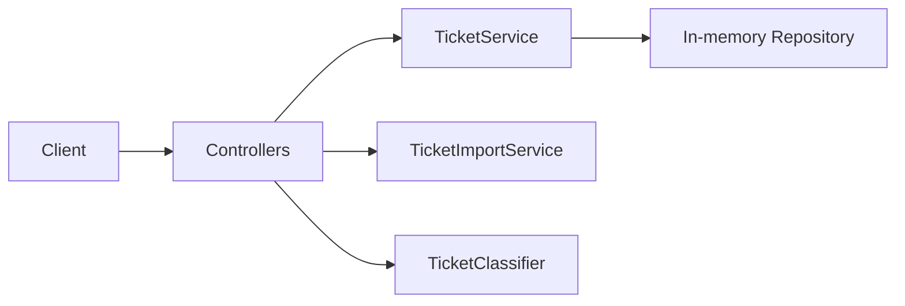
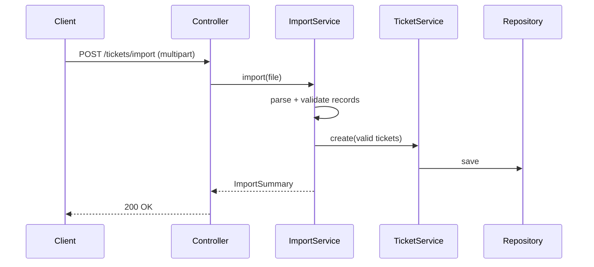

# Architecture

## High-Level Design

## Components
- Controllers: expose REST endpoints, validation and error handling.
- TicketService: business logic, timestamps, updates.
- TicketRepository: thread-safe in-memory store (ConcurrentHashMap).
- TicketImportService: parse CSV/JSON/XML, validate and persist, summarize results.
- TicketClassifier: rule-based keyword matching with confidence and decision log.

## Data Flow (Import)

## Decisions & Trade-offs
- In-memory storage: simplicity over persistence; suitable for homework.
- Rule-based classifier: deterministic and testable; ML could be added later.
- Snake_case JSON: improves alignment with CSV headers and clarity.

## Security & Performance
- Validate inputs; strict deserialization (`fail-on-unknown-properties`).
- Concurrency: repository is thread-safe; tests planned for 20+ concurrent ops.
- Performance: basic load via parallel requests; optional Gatling scenario.
