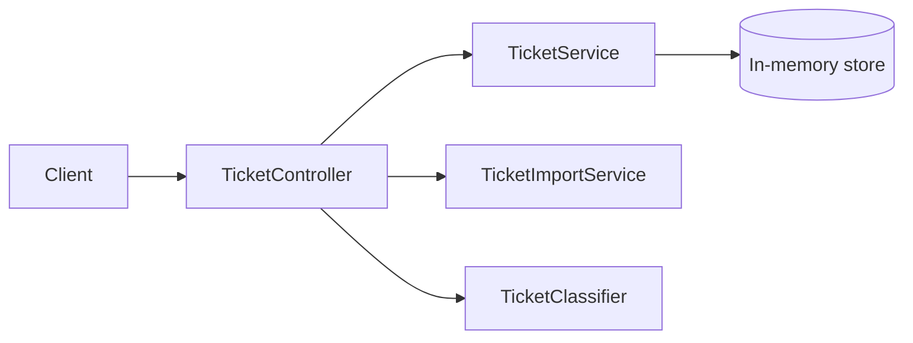

# 🎧 Homework 2: Intelligent Customer Support System

> **Student Name**: Musiinko Serhii  
> **Date Submitted**: 03.02.2026  
> **AI Tools Used**: GitHub Copilot

## What it does
- CRUD for support tickets (`/tickets`)
- Bulk import from CSV/JSON/XML (`/tickets/import`) with validation + summary
- Auto-classification (`/tickets/{id}/auto-classify`) + optional `autoClassify=true` on create
- Filtering by `category`, `priority`, `status`, `tag`, and created-at range (`from`/`to`)

## Tech notes
- Java 21, Spring Boot
- In-memory storage (`ConcurrentHashMap`) — data resets on restart
- JSON uses `snake_case` (configured in `application.yml`)

## Run
See [homework-2/HOWTORUN.md](homework-2/HOWTORUN.md) (port `8080`).

## Tests
- Run: `gradle test` (Gradle wrapper jar is missing in this repo)
- Coverage report: `gradle test jacocoTestReport` (HTML: `build/reports/jacoco/test/html/index.html`)

## Docs
- [homework-2/docs/API_REFERENCE.md](homework-2/docs/API_REFERENCE.md) — endpoints + examples
- [homework-2/docs/ARCHITECTURE.md](homework-2/docs/ARCHITECTURE.md) — component overview
- [homework-2/docs/TESTING_GUIDE.md](homework-2/docs/TESTING_GUIDE.md) — how to run tests + fixtures
- [homework-2/docs/TEST_COVERAGE.md](homework-2/docs/TEST_COVERAGE.md) — current JaCoCo numbers
