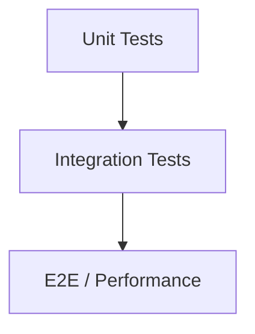

# Testing Guide

## Test Pyramid (Mermaid)


## How to Run
```bash
cd homework-2
./gradlew test
./gradlew jacocoTestReport
```

## Test Data
- Fixtures: `src/test/resources/fixtures/`
  - `sample_tickets.json` — includes valid and invalid records
  - `sample_tickets.csv` — includes valid and invalid lines

## Manual Testing Checklist
- Create ticket with `autoClassify=true` and verify classification fields.
- Bulk import CSV/JSON/XML and verify summary (totals, successes, failures).
- Update ticket partially and confirm fields updated.
- Delete ticket and verify 404 on subsequent get.
- Concurrent requests (20+): list/create/update and ensure consistency.

## Performance Benchmarks (example)
| Scenario | Requests | Target | Result |
|---------|----------|--------|--------|
| Create tickets | 200 | < 500ms p95 | TBD |
| Import JSON (20) | 1 | < 2s total | TBD |
| Concurrent list (20) | 20 | < 300ms p95 | TBD |

## Coverage
- JaCoCo HTML: [homework-2/build/reports/jacoco/test/html/index.html](homework-2/build/reports/jacoco/test/html/index.html)
- JaCoCo XML: [homework-2/build/reports/jacoco/test/jacocoTestReport.xml](homework-2/build/reports/jacoco/test/jacocoTestReport.xml)
- Summary: [homework-2/docs/test_coverage.md](homework-2/docs/test_coverage.md)
- Target: ≥85% across all coverage types (instruction, branch, line, complexity, method, class)
