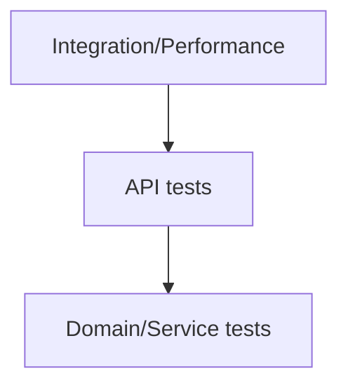

````markdown
# Testing Guide



- Run all tests: `gradle test` (wrapper jar is missing)
- Generate coverage: `gradle test jacocoTestReport`
- Reports: `build/reports/tests/test/index.html`, `build/reports/jacoco/test/html/index.html`
- Fixtures: `src/test/resources/fixtures/*` (valid + malformed CSV/JSON/XML)
- Manual smoke: start app, then run `demo/requests.sh`

````
