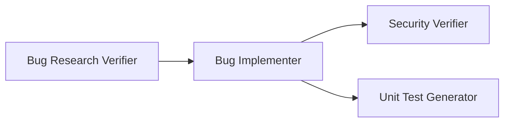

# 🏦 Homework 4: Multi-Agent Bug Fix Pipeline

> **Student Name**: Serhii Musiienko
> **Date Submitted**: 01.03.2026
> **AI Tools Used**: VS Code GitHub Copilot Agent mode (Claude Opus 4.6, Claude Sonnet 4.6)

---

## 📋 Project Overview

This project demonstrates a 4-agent pipeline for bug fixing and quality assurance:

- **Bug Research Verifier**: Fact-checks bug research, verifies references and code snippets, rates research quality.
- **Bug Implementer**: Applies the implementation plan, runs tests, documents changes.
- **Security Verifier**: Reviews changed code for vulnerabilities, rates findings, suggests remediations.
- **Unit Test Generator**: Generates and runs unit tests for changed code, ensures FIRST principles.

---

## 🛠️ Agents & Skills

- **Agents**: Each agent is defined in `agents/` and performs a specific role in the pipeline.
- **Skills**: Agents use skills from `skills/`:
  - `research-quality-measurement`: Used by Research Verifier to rate research.
  - `unit-tests-FIRST`: Used by Unit Test Generator to enforce FIRST principles.

---

## 🧩 Pipeline Diagram

---

## 🚀 How to Run the Pipeline

1. Run Bug Research Verifier (select agent, verify research).
2. Run Bug Implementer (apply plan, run tests).
3. Run Security Verifier (scan changed code).
4. Run Unit Test Generator (generate and run tests).

Artifacts are saved in `context/bugs/API-404/`:
- `verified-research.md`, `implementation-plan.md`, `fix-summary.md`, `security-report.md`, `test-report.md`

---

## 🖥️ How to Run the Demo App

1. `cd homework-4/demo-bug-fix`
2. `npm install`
3. `node server.js`
4. Test endpoints (e.g., `curl http://localhost:3000/api/users/123`)

---

## 🔗 Pipeline Artifacts

See all agent outputs in [context/bugs/API-404/](homework-4/context/bugs/API-404/)

---

*This project was completed as part of the AI-Assisted Development course.*

